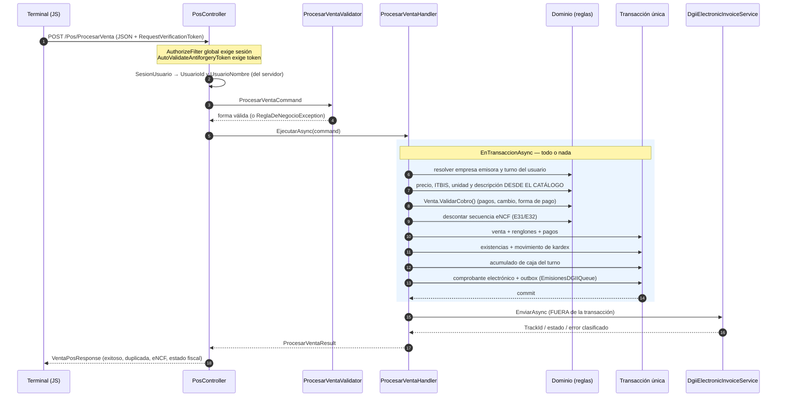
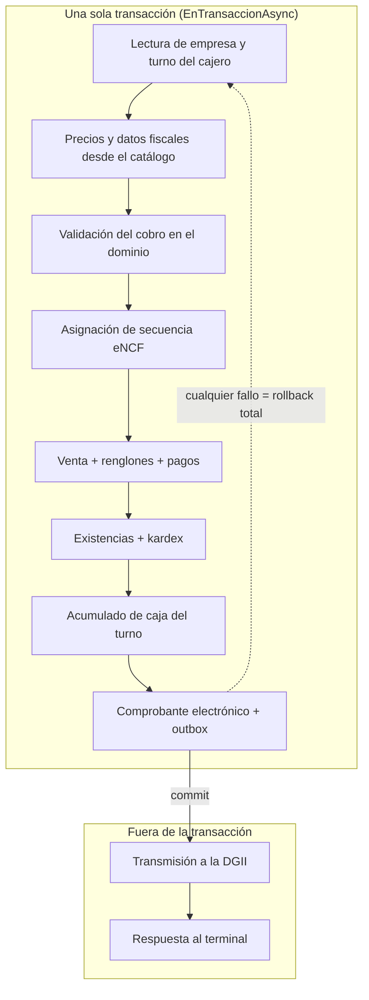
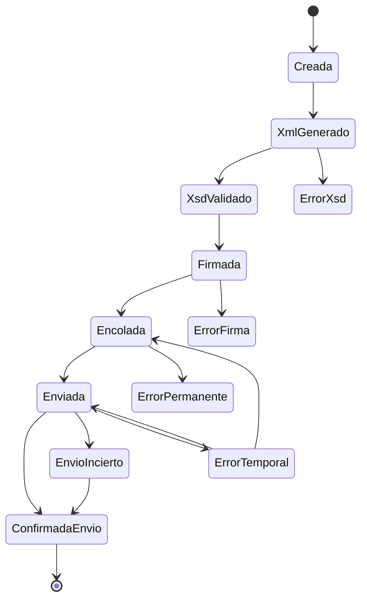
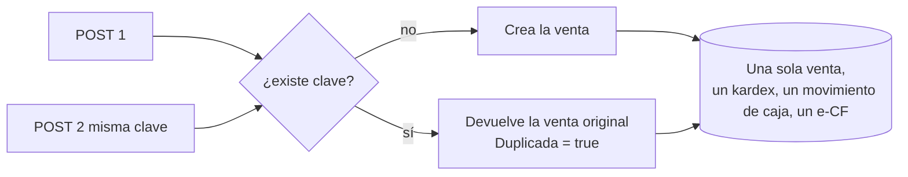
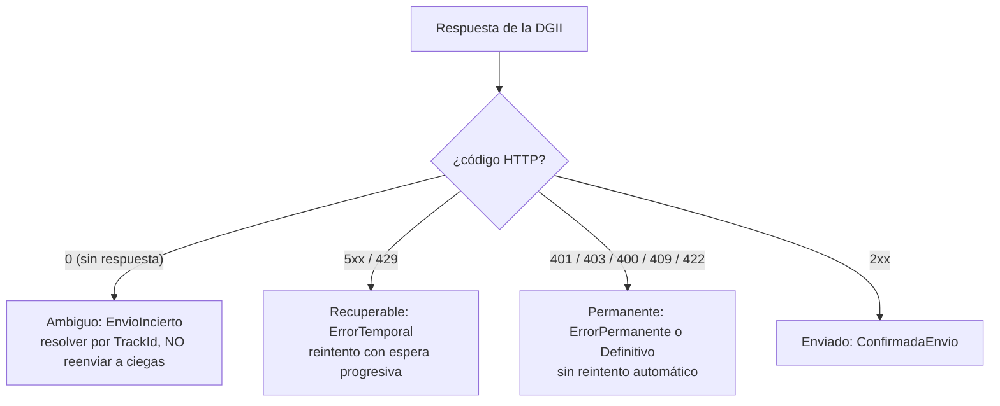

# Flujo de venta transaccional (POS)

> Estado: **FASE 1 + FASE 2 ejecutadas**. La venta ya no vive en el controlador: existe un caso de uso
> en `POS.Application`, se ejecuta dentro de una única transacción y la transmisión a la DGII ocurre
> fuera de ella. Este documento describe el flujo real (no el deseado), su frontera transaccional, sus
> estados, su idempotencia y su numeración fiscal.

---

## 1. Arquitectura antes / después

### Antes

```text
PosController.ProcesarVentaVieja  (≈300 líneas)
  ├── resolvía precios del request  ← el navegador era la autoridad
  ├── calculaba ITBIS y totales
  ├── asignaba el eNCF con GetLastENCF + 1  (sin bloqueo)
  ├── descontaba inventario
  ├── actualizaba la caja
  ├── insertaba el comprobante
  ├── encolaba la emisión
  └── catch { /* el fallo se convertía en "venta exitosa" */ }
```

Cada repositorio hacía su propio `SaveChanges`: una venta era **6 + 2n confirmaciones independientes**,
sin transacción, sin idempotencia y sin control de concurrencia.

### Después

```text
PosController.ProcesarVenta   ← adaptador HTTP (≈60 líneas: traduce y responde)
        ↓
ProcesarVentaValidator        ← validación de FORMA
        ↓
ProcesarVentaHandler          ← caso de uso
        ↓
POS.Domain                    ← reglas: cobro, cambio, línea fiscal, secuencia eNCF, estados
        ↓
Repositorios / IUnidadDeTrabajo
        ↓
Infrastructure (EF Core, SQL Server / SQLite)
```

El controlador ya no calcula importes, no asigna numeración, no mueve inventario y no decide estados.
El servicio registrado en DI para el caso de uso es `ProcesarVentaHandler`
(`POS.Application.CasosDeUso.Ventas`).

---

## 2. Flujo real de una venta



### Qué NO hace la venta

- No firma el XML ni lo valida contra el XSD (FASE 5 y 6). El comprobante se registra en estado
  `Creada`/`XmlGenerado` y la máquina de estados ya tiene los pasos `XsdValidado` y `Firmada` previstos.
- No decide el resultado fiscal: `EstadoFiscal` es lo que la DGII responde, `EstadoEmision` es el eje
  técnico local. Un HTTP 200 del simulador **no** equivale a "comprobante aceptado".

---

## 3. Contrato del caso de uso

```csharp
// Entrada: solo lo que decide el cajero.
ProcesarVentaCommand {
    Guid ClaveIdempotencia        // obligatoria: sin ella no hay protección contra duplicados
    int  UsuarioId, string UsuarioNombre   // los inyecta el servidor, no el navegador
    TipoeCFType TipoeCF           // 31 o 32 únicamente desde el POS
    TipoPago, MetodoPago, MontoRecibido?
    string? RNCComprador, RazonSocialComprador
    List<ItemVentaCommand> { ProductoId, Cantidad, Descuento }   // sin precio: lo pone el servidor
    List<PagoVentaCommand> { MetodoPago, Monto, Referencia }
}

// Salida: tres cosas separadas a propósito.
ProcesarVentaResult {
    bool Exitoso        // la venta quedó registrada y cobrada localmente
    bool Duplicada      // se devolvió la venta original de la misma clave
    decimal Total, Cambio
    EstadoFacturaElectronica EstadoFiscal   // lo que dice la DGII
    EstadoEmisionECF EstadoEmision          // qué se ha construido/enviado localmente
    bool EsOfflineDGII  // registrada pero sin confirmación de la DGII
    string? CodigoError, Mensaje
}
```

### Validación de forma (`ProcesarVentaValidator`)

| Código | Causa |
|---|---|
| `SOLICITUD_NULA` | no llegó comando |
| `CLAVE_IDEMPOTENCIA_REQUERIDA` | falta la clave (no se puede garantizar no-duplicación) |
| `USUARIO_REQUERIDO` | no se pudo identificar al usuario de la sesión |
| `CARRITO_VACIO` | venta sin líneas |
| `PRODUCTO_REQUERIDO` / `CANTIDAD_INVALIDA` / `DESCUENTO_INVALIDO` | línea mal formada |
| `PRODUCTO_REPETIDO` | el carrito manda dos veces el mismo producto (debe consolidarse) |
| `TIPO_ECF_NO_SOPORTADO` | el POS solo emite 31 y 32 |
| `RNC_COMPRADOR_REQUERIDO` / `RNC_COMPRADOR_INVALIDO` | e-CF 31 exige RNC válido del comprador |
| `PAGO_INVALIDO` / `MONTO_RECIBIDO_INVALIDO` | pago o efectivo <= 0 / negativo |

Todo lo que depende del catálogo (existencia, precio, producto activo) **no** se valida aquí: se valida
en el manejador con los datos reales.

---

## 4. Frontera transaccional



**Regla:** la DGII nunca forma parte de la transacción. Si la transmisión falla, la venta **ya está
cobrada** y el comprobante queda en la cola para reintento; la venta no se revierte por un problema de
red externo, y tampoco se reporta como "aceptada por la DGII" cuando no lo está.

Consecuencias verificadas (pruebas de fallo):

| Fallo inyectado | Resultado |
|---|---|
| Fallo al registrar el comprobante a mitad de la venta | rollback total: sin venta, sin kardex, sin caja, sin número consumido |
| Stock insuficiente (política estricta) | 400 `STOCK_INSUFICIENTE`, sin rastro y sin quemar el eNCF |
| DGII sin respuesta | venta registrada + comprobante encolado, `EsOfflineDGII = true` |
| Colisión de numeración (carrera) | reintento de asignación (hasta 3) sin duplicar el número |

---

## 5. Estados: dos ejes ortogonales

`EstadoFacturaElectronica` mezclaba "en proceso de la DGII" con "recién creada localmente". Ahora hay
dos ejes y el resultado del caso de uso expone ambos.

### Eje técnico local — `EstadoEmisionECF`



Reglas que impone la máquina (`EstadoEmisionECFTransiciones`):

1. **Nunca se retrocede** en la línea de emisión: no se "desfirma" ni se vuelve a crear.
2. **Un estado terminal no se reabre**: `ConfirmadaEnvio` (éxito) y `ErrorXsd` / `ErrorFirma` /
   `ErrorPermanente` (fallo definitivo) no vuelven a estados de trabajo.
3. **Un envío incierto no se reintenta a ciegas**: solo se resuelve confirmando la recepción
   (consultando el TrackId). Reenviar un documento que pudo llegar produce duplicado fiscal.
4. **Se admite avanzar saltando pasos no implementados** (`XsdValidado`, `Firmada`): cuando la FASE 5 y
   la FASE 6 se implementen, se insertan en la máquina sin cambiar sus reglas.

### Eje fiscal — `EstadoFacturaElectronica`

`NoEnviado` (inicial y correcto) · `EnProceso` (hay TrackId, se consulta) · `Aceptado` · `Rechazado` ·
`Anulado` · `PendienteReenvio` (contingencia local).

### Cola de emisión — `EstadoColaDGII` (outbox persistente)

`Pendiente` · `EnProceso` (lease vigente) · `Enviado` (único terminal de éxito) · `Fallido` (intentos
agotados) · `Definitivo` (error no recuperable).

---

## 6. Idempotencia

El terminal genera **una** `ClaveIdempotencia` por carrito y la reenvía en cada intento. El servidor la
persiste en `Ventas.ClaveIdempotencia` con **índice único**: la base de datos es la barrera, no el código.

> Nota (Fase 3): la sección de deuda mencionaba el §6 como pendiente de aclaración — esta es la política
> vigente.



Esto cubre: doble clic, doble POST, recarga de la página, reintento por timeout y reenvío del terminal.

**Verificado de extremo a extremo:** dos POST idénticos con la misma clave devuelven `200` los dos,
el segundo con `Duplicada = true` y el mismo `VentaId`/`eNCF`; la base de datos conserva **una** venta,
un solo movimiento de inventario y una sola transacción en la caja.

Si la clave llega vacía, el controlador genera una nueva y **registra una advertencia**: sin ella no hay
protección contra duplicados (compatibilidad con terminales antiguos, deuda declarada).

**Política de la clave (Fase 3):** el navegador la genera **una vez por carrito** (al abrir el terminal
se crea `claveVenta`) y la reutiliza en cada reintento de la misma venta; se renueva al terminar o
cancelar la venta. El servidor **no rechaza** solicitudes sin clave (mantener operativos los terminales
existentes) pero sí las marca en el log para su detección. Requerir la clave de forma obligatoria
(opción A) se evaluará cuando exista integración por API, donde será requisito de contrato.

---

## 7. eNCF y concurrencia

- La serie se deriva del tipo: **E31** (crédito fiscal) y **E32** (consumo). El número tiene 13
  caracteres.
- El consecutivo vive en la tabla `SecuenciasECF` (una fila por serie, `Ultimo` + rango autorizado) y su
  lectura/avance ocurre **dentro de la transacción de la venta**.
- La fila se crea bajo demanda: una serie sin fila no impide vender (arranca en 0), y una venta
  revertida no crea ni avanza la secuencia.
- La unicidad del `eNCF` está garantizada por **índice único en la base de datos**. Si dos ventas
  simultáneas calculan el mismo número, la que pierde recibe un conflicto de unicidad (`ENCF_DUPLICADO`),
  la transacción se revierte y el caso de uso **reintenta la asignación** (hasta 3 intentos);
  agotados, responde `ENCF_NO_DISPONIBLE` sin registrar la venta.
- Los saltos de numeración solo pueden producirse por ventas revertidas, que es exactamente el caso en
  el que el número **no** debe consumirse.

> La asignación se hace con bloqueo de fila en SQL Server (`UPDLOCK, ROWLOCK`, Fase 3): los emisores
> esperan su turno en el punto fiscal en vez de competir; con SQLite (pruebas) se usa el camino
> optimista y el índice único como barreras. Mediciones 1→100 concurrentes y la mezcla 31/32 en dos
> sucursales están en `09_Concurrencia_eNCF.md`: 0 duplicados en todos los escenarios.

---

## 8. Inventario

- El descuento ocurre **dentro de la transacción de la venta** y deja kardex
  (`MovimientoInventario` con `StockAnterior`, `StockNuevo`, `Tipo = VentaPOS`, costo unitario).
- El descuento es **condicional y atómico**: `DescontarStockAsync` aplica el descuento solo si la
  existencia alcanza; si no, informa `Aplicado = false` con la existencia real y el manejador lanza
  `STOCK_INSUFICIENTE` → rollback.
- Si el producto no tiene fila de existencia en la sucursal del turno, se trata como **no registrado**
  (no como "ilimitado") y el mensaje lo dice explícitamente.
- **Política configurable por empresa (Fase 3):** `Enterprise.PoliticaStock` con tres estados,
  impuesta por el servidor dentro de la transacción (detalle en `08_Politica_Stock.md`):
  - `Permitir` (defecto): la venta se registra y la existencia queda **negativa**, con kardex exacto.
  - `Advertir`: la venta prosigue y queda **marcada** (`RequiereRevisionStock` en la venta,
    `RequiereRevision` y concepto `ADVERTENCIA…` en el kardex) para revisión; una venta normal no se marca.
  - `Bloquear`: rechazo antes de tocar inventario, caja, venta, eNCF u outbox.
  El cambio de política queda auditado (usuario, fecha, valores, motivo).

---

## 9. Caja

- No se puede vender **sin turno de caja abierto del usuario autenticado**: el turno se resuelve por
  `UsuarioId` de la sesión, no por el nombre escrito en la pantalla. Vender con el turno de otro usuario
  está rechazado.
- El turno acumula `VentasEfectivo`, `VentasTarjeta`, `VentasTransferencia`, `TotalVentas` y
  `CantidadTransacciones` dentro de la misma transacción de la venta.
- El cobro lo valida el dominio (`Venta.ValidarCobro`): pagos ausentes, insuficientes, que excedan el
  total en medios distintos del efectivo, cambio sin efectivo suficiente y formas de pago que el arqueo
  no controla (`FORMA_PAGO_NO_SOPORTADA`).
- El cierre es atómico (`CerrarTurnoAsync`): el efectivo esperado y la diferencia se calculan en la
  base de datos y solo el primer cierre se aplica; un segundo intento no altera el arqueo.

---

## 10. Errores y reintentos



`ClasificadorErroresDGII` decide recuperable/permanente y si el envío es ambiguo. La espera de reintento
es exponencial con jitter determinista por documento (30 s → 60 s → … tope 1 h), máximo 8 intentos, con
`lease` de 5 minutos por trabajador: si el proceso muere, otro retoma el elemento al vencer el lease y
nunca hay dos trabajadores sobre el mismo comprobante.

**Regla de honestidad fiscal:** `XML generado` ≠ `e-CF aceptado`; `HTTP 200` ≠ `comprobante válido`.

---

## 11. Matriz de escenarios (resultados reales)

| Escenario | Venta | Inventario | Caja | e-CF | Estado final | Prueba |
|---|---|---|---|---|---|---|
| Venta normal (HTTP) | registrada | −1 + kardex | +efectivo | registrado y enviado (simulador) | confirmado localmente, outbox 1 | `VentaPorHttp_RegistraVentaInventarioCajaComprobanteYCola` |
| Stock insuficiente (estricta) | **no** | intacto | intacta | **sin consumir número** | 400 `STOCK_INSUFICIENTE` | `VentaPorHttp_PoliticaEstricta_RechazaVentaSinStockYNoQuemaElNumeroFiscal` |
| Política permisiva | registrada | −2 (negativo) + kardex | +efectivo | registrado | 200, existencia negativa documentada | `VentaPorHttp_PoliticaPermisiva_RegistraLaExistenciaNegativaConKardex` |
| Doble POST / doble clic | **una sola** | −1 | +1 transacción | **uno** | `Duplicada = true` | `VentaPorHttp_DoblePostConLaMismaClave_RegistraUnaSolaVenta` |
| Reintento del terminal | devuelve la original | sin cambio | sin cambio | el mismo | idempotente | `MismaClaveDeIdempotencia_DevulveLaVentaOriginal` |
| Sin sesión | **no** | intacto | intacta | — | 302 a login | `VentaPorHttp_SinSesion_RedirigeAlLoginYNoRegistraNada` |
| Sesión sin token antiforgery | **no** | intacto | intacta | — | 400 | `VentaPorHttp_SinTokenAntiforgery_Devuelve400YNoRegistraNada` |
| Sin turno de caja | **no** | intacto | intacta | — | 400 `SIN_TURNO_DE_CAJA` | `VentaPorHttp_SinTurnoDeCajaAbierto_Devuelve400YNoRegistraNada` |
| Precio manipulado en el navegador | registrada al precio real | −1 | al total real | con el importe real | el precio del request se ignora | `VentaPorHttp_PrecioManipuladoPorElTerminal_NoAlteraElCobro` |
| Fallo al registrar el comprobante | **rollback total** | sin kardex | sin movimiento | sin número | nada escrito | `FalloAlRegistrarElComprobante_RevientaLaVentaCompleta` |
| DGII sin respuesta | registrada | −1 | +efectivo | encolado | `EsOfflineDGII = true` | `DgiiNoDisponible_LaVentaQuedaRegistradaYEncolada` |
| DGII confirma | registrada | −1 | +efectivo | enviado | cola cerrada | `DgiiConfirma_LaColaQuedaCerrada` |
| Carrera de numeración | una sola gana | coherente | coherente | números distintos | reintento de asignación | `VentasSimultaneas_NoDuplicanNumeroDeComprobanteNiGeneranStockNegativo` |
| **XML inválido / XSD** | — | — | — | — | **pendiente (FASE 5)** | — |
| **Firma XSD-DSig falla** | — | — | — | — | **pendiente (FASE 6)** | — |
| **DGII timeout con ambigüedad de TrackId** | registrada | −1 | +efectivo | `EnvioIncierto` | pendiente de resolución por consulta | cubierto en dominio; falta E2E contra DGII real (FASE 7) |

---

## 12. Cobertura de pruebas de la fase

| Tipo | Proyecto | Cantidad |
|---|---|---|
| Dominio y reglas de cobro / estados / secuencia eNCF | `POS.Domain.Types.Tests` | 63 |
| Caso de uso + integración con base de datos real (SQLite) y cliente DGII falso | `POS.Ventas.Tests` | 58 |
| Seguridad HTTP + **E2E de la venta por el pipeline real** | `POS.UI.SecurityTests` | 91 (8 nuevas E2E) |
| **Total** | | **212 en verde** |

---

## 13. Deuda técnica declarada

1. **`Enterprise.PermitirVentaSinStock` nace en `true`** (y el DDL usa `DEFAULT 1`): el sistema permite
   vender sin existencias de fábrica. Decidir la política y alinear el valor por defecto. *(FASE 3)*
2. **Validación XSD y firma XML-DSig no integradas**: la máquina de estados las prevé, pero el
   comprobante se transmite sin `<Signature>` y sin validación por esquema. *(FASE 5 y 6)*
3. **ANECF incompatible con `ANECF v.1.0.xsd`** y código de seguridad calculado fuera del XML. *(FASE 5)*
4. **Concurrencia validada sobre SQLite**: falta la prueba de carga sobre SQL Server con bloqueo real. *(FASE 3)*
5. **Sin migraciones EF Core**: el esquema se mantiene con DDL idempotente en `DbInitializer`. *(FASE 12)*
6. **Terminales antiguos sin `ClaveIdempotencia`**: se advierte y se genera una clave nueva, sin protección
   real contra reenvíos en ese caso (política de clave en §6).
7. Consulta de `FirstOrDefault` sin `OrderBy` en la resolución heredada de empresa/sucursal (aviso
   `EF.Query 10103`): no afecta la venta, pero debe fijarse el criterio.
8. ~~Doble ruta de venta~~ **Resuelto en Fase 3**: la emisión libre de comprobantes
   (`FacturacionController.Emitir`) fue retirada; `ProcesarVentaHandler` es el único camino de registro
   y la numeración la asigna siempre `SecuenciaECFRepository`.
9. **Devoluciones, caja y arqueo** — **Resuelto en Fase 4** (ver
   [`10_Caja_Devoluciones.md`](10_Caja_Devoluciones.md)): reembolso por la forma de pago original,
   movimiento de caja referenciado a la venta, tope de reembolso serializado ante devoluciones
   concurrentes e idempotencia de devolución. La generación del e-CF de crédito / ANECF ante la
   DGII queda para las fases fiscales.
